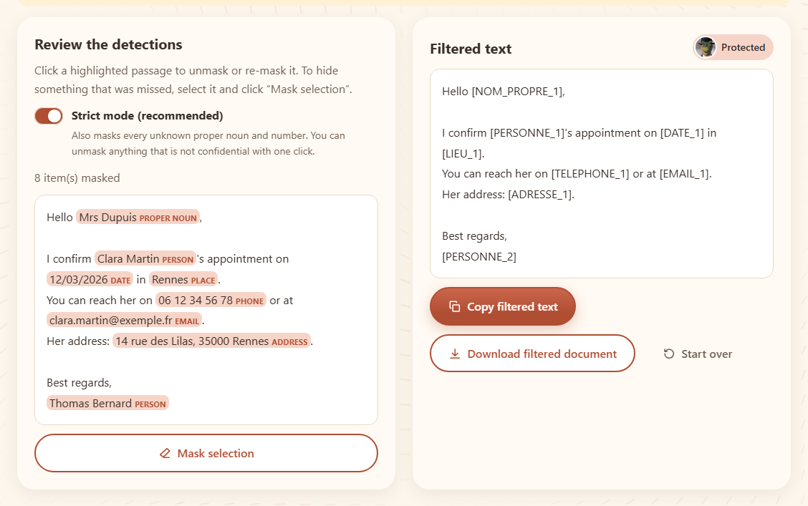

# I Love My P.D.F.

*[Version française](README.md)*

**Your data never leaves your browser.**

I Love My P.D.F. (*P.D.F.* stands for **Private Data Filter**) is a free, open-source site to prepare your documents before sharing them. All processing happens in the browser: no file and no text is ever sent to a server.

Site: https://i-love-my-pdf.vercel.app



## The tools

| Tool | What it does |
|---|---|
| **Filter** | Finds the personal data in a text, a `.txt`, a `.docx` or a `.pdf` and replaces it with labels (`[PERSONNE_1]`, `[EMAIL_1]`…), so you can hand it to an AI safely. Review with one-click unmasking and manual masking. For a PDF: a redacted PDF with black boxes. |
| **Merge** | Joins several PDFs in the chosen order (drag and drop). |
| **Split** | Extracts pages or cuts a PDF into several files (ZIP). |
| **PDF → Word** | Produces an editable `.docx` (headings, paragraphs, bold, italic). |
| **Word → PDF** | Produces a PDF with real, selectable text. |

## Privacy

- **Nothing leaves your device**: files are read and processed by the browser, in Web Workers. The site has no processing server.
- **No connection to any other site**: a Content-Security-Policy (`connect-src 'self'`) forbids it, and an automated test checks it for every tool. Libraries, fonts and word lists are served by the site itself.
- **No cookies, no trackers, no analytics, no account.**
- **Check it yourself**: open your browser's developer tools (F12), "Network" tab, and use a tool.

### The personal data filter

It combines format rules (email, phone, IBAN with check digits, French social security number, bank card, dates, addresses, IP, links), identifier labels ("N°", "Matricule"…), official lists of first names, surnames and French towns, and a **strict mode** (on by default) that also masks every unknown proper noun or number. Its reliability is measured on annotated fictitious documents: the test fails if a single piece of personal data gets through. No automatic detection is perfect: **always review the result**. Details and limits (in French): [docs/detection.md](docs/detection.md).

## Getting started

Requirements: Node.js 22.12 or later.

```bash
npm install
npm run dev
```

The site is then available at http://localhost:4321.

| Command | Purpose |
|---|---|
| `npm run dev` | Development server |
| `npm run build` | Builds the static site into `dist/` |
| `npm run preview` | Serves the built site |
| `npm run check` | Type checks (Astro + TypeScript) |
| `npm test` | Unit tests (Vitest) |
| `npm run test:e2e` | End-to-end tests (Playwright; first install the browsers with `npx playwright install chromium webkit`) |

## Architecture

A static [Astro](https://astro.build) site with [React](https://react.dev) islands, in TypeScript.

```
src/
  core/        pure functions, no DOM: detection, labels, DOCX, PDF, conversions
  workers/     Web Workers exposing the core through Comlink
  components/  one React island per tool, shared UI components, pdf.js in the page
  pages/[lang] one page per tool and language (fr, en)
  i18n/        French and English texts
public/lexicon lists of first names, surnames, towns and common words (see SOURCES.md)
e2e/           Playwright tests
docs/          how the detection engine works
```

## Known limits

- The filter does not understand meaning: names written in lower case, indirect information (age, job…) and text inside images are not detected.
- Scanned PDFs (with no text layer) are not supported.
- PDF ↔ Word conversions give an approximate layout.

## Contributing

Contributions are welcome: read the [contributing guide](CONTRIBUTING.md).

## Licence and credits

Code under the [MIT licence](LICENSE), © 2026 Ambroise Jessenne. Third-party components keep their own licences:

- Libraries: Astro, React (MIT); pdf.js (Apache 2.0); pdf-lib, @pdf-lib/fontkit, fflate, docx (MIT); mammoth (BSD 2-Clause); Comlink (Apache 2.0).
- Data: first names and surnames — INSEE; French towns, départements and régions — geo.api.gouv.fr; both under the Licence Ouverte / Open Licence 2.0 (Etalab). Word lists — Loren Brichter, *Words*, CC0 1.0. Details: [public/lexicon/SOURCES.md](public/lexicon/SOURCES.md).
- Font: Liberation Sans (Red Hat), GPL v2 with an exception for embedding in documents, shipped with pdf.js.
- Filter tool illustration after René Magritte, *The Son of Man* (1964). Yes, I don't own the rights… so what?
