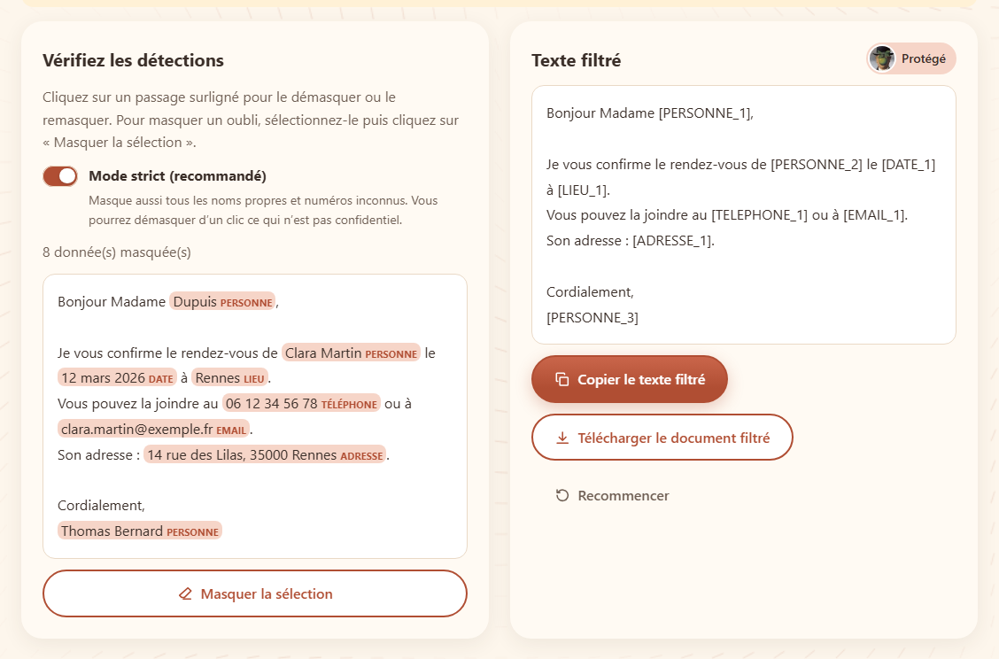

# I Love My P.D.F.

*[English version](README.en.md)*

**Vos données ne quittent jamais votre navigateur.**

I Love My P.D.F. (*P.D.F.* pour **Private Data Filter**) est un site gratuit et libre pour préparer vos documents avant de les partager. Tout le traitement a lieu dans le navigateur : aucun fichier, aucun texte n'est envoyé à un serveur.

Site : https://i-love-my-pdf.vercel.app



## Les outils

| Outil | Ce qu'il fait |
|---|---|
| **Filtrer** | Repère les données personnelles d'un texte, d'un `.txt`, d'un `.docx` ou d'un `.pdf` et les remplace par des étiquettes (`[PERSONNE_1]`, `[EMAIL_1]`…), pour les confier sans risque à une IA. Relecture avec démasquage en un clic et masquage manuel. Pour un PDF : PDF masqué par des encarts noirs. |
| **Fusionner** | Réunit plusieurs PDF dans l'ordre choisi (glisser-déposer). |
| **Diviser** | Extrait des pages ou découpe un PDF en plusieurs fichiers (ZIP). |
| **PDF → Word** | Produit un `.docx` modifiable (titres, paragraphes, gras, italique). |
| **Word → PDF** | Produit un PDF avec du vrai texte, sélectionnable. |

## Confidentialité

- **Rien ne part sur Internet** : les fichiers sont lus et traités par le navigateur, dans des *Web Workers*. Le site n'a pas de serveur de traitement.
- **Aucune connexion vers un autre site** : une *Content-Security-Policy* (`connect-src 'self'`) l'interdit, et un test automatique le vérifie pour chaque outil. Les bibliothèques, les polices et les listes de mots sont servies par le site lui-même.
- **Ni cookie, ni traceur, ni statistiques, ni compte.**
- **Vérifiez-le vous-même** : ouvrez les outils de développement du navigateur (F12), onglet « Réseau », et utilisez un outil.

### Le filtre de données personnelles

Il combine des règles de format (email, téléphone, IBAN avec clé, numéro de sécurité sociale, carte bancaire, dates, adresses, IP, liens), des intitulés d'identifiants (« N° », « Matricule »…), des listes officielles de prénoms, de noms et de communes, et un **mode strict** (activé par défaut) qui masque aussi tout nom propre ou numéro inconnu. Sa fiabilité est mesurée sur des documents fictifs annotés : le test échoue si une seule donnée passe. Aucune détection automatique n'est parfaite : **relisez toujours le résultat**. Détails et limites : [docs/detection.md](docs/detection.md).

## Démarrer

Prérequis : Node.js 22.12 ou plus récent.

```bash
npm install
npm run dev
```

Le site est alors disponible sur http://localhost:4321.

| Commande | Rôle |
|---|---|
| `npm run dev` | Serveur de développement |
| `npm run build` | Construit le site statique dans `dist/` |
| `npm run preview` | Sert la version construite |
| `npm run check` | Vérifie les types (Astro + TypeScript) |
| `npm test` | Tests unitaires (Vitest) |
| `npm run test:e2e` | Tests de bout en bout (Playwright ; installez d'abord les navigateurs avec `npx playwright install chromium webkit`) |

## Architecture

Site statique [Astro](https://astro.build) avec des îlots [React](https://react.dev), en TypeScript.

```
src/
  core/        fonctions pures, sans DOM : détection, étiquettes, DOCX, PDF, conversions
  workers/     Web Workers qui exposent le cœur via Comlink
  components/  îlots React par outil, composants d'interface partagés, pdf.js côté page
  pages/[lang] une page par outil et par langue (fr, en)
  i18n/        textes français et anglais
public/lexicon listes de prénoms, noms, communes et mots courants (voir SOURCES.md)
e2e/           tests Playwright
docs/          fonctionnement du moteur de détection
```

## Limites connues

- Le filtre ne comprend pas le sens du texte : noms écrits en minuscules, informations indirectes (âge, profession…) et texte dans les images ne sont pas détectés.
- Les PDF scannés (sans couche texte) ne sont pas pris en charge.
- Les conversions PDF ↔ Word donnent une mise en page approximative.

## Contribuer

Les contributions sont bienvenues : lisez le [guide des contributeurs](CONTRIBUTING.md).

## Licence et crédits

Code sous licence [MIT](LICENSE), © 2026 Ambroise Jessenne. Les composants tiers gardent leur propre licence :

- Bibliothèques : Astro, React (MIT) ; pdf.js (Apache 2.0) ; pdf-lib, @pdf-lib/fontkit, fflate, docx (MIT) ; mammoth (BSD 2-Clause) ; Comlink (Apache 2.0).
- Données : prénoms et noms de famille — INSEE ; communes, départements et régions — geo.api.gouv.fr ; tous deux sous Licence Ouverte / Open Licence 2.0 (Etalab). Listes de mots — Loren Brichter, *Words*, CC0 1.0. Détails : [public/lexicon/SOURCES.md](public/lexicon/SOURCES.md).
- Police : Liberation Sans (Red Hat), GPL v2 avec exception pour l'incorporation dans les documents, fournie avec pdf.js.
- Image pour le filtrage : *Le Fils de l'homme* (1964).
